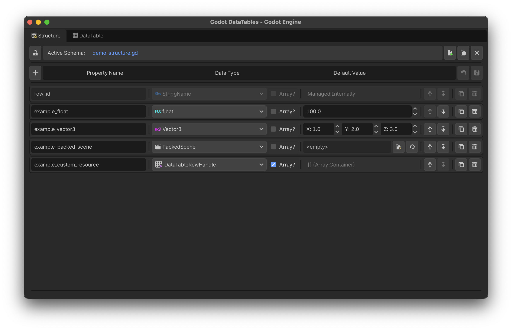

# Data Structures
{: .no_toc }

Before you can populate a table with data, you need a blueprint. In Godot DataTables, this is called a **Data Structure**.

The Data Structure workspace allows you to visually define the columns (properties) of your dataset. When you are finished, the addon compiles your visual layout into a highly optimized, strongly-typed GDScript (`.gd`) class.

  

    Table of contents
  

  {: .text-delta }
1. TOC
{:toc}

---

## The Structure Workspace

To access the workspace, click the **Data Structure** tab in the bottom editor panel. Every schema begins with a permanent, unmodifiable `row_id` property, which acts as the unique identifier (Primary Key) for your rows.

### Supported Data Types
Unlike generic CSV workflows, Godot DataTables natively supports the engine's strict typing system. You can define fields using:
* **Primitives:** `int`, `float`, `bool`, `String`, `StringName`.
* **Math & Visual:** `Vector2`, `Vector3`, `Color`.
* **Native Resources:** `Texture2D`, `PackedScene`, or even your own Custom Resources.
* **Enums:** Define a comma-separated list of strings. The tool will automatically generate a native GDScript `@export_enum` for you.
* **Arrays:** Simply check the **Array?** box next to any type to instantly turn that field into a strictly-typed Godot Array (e.g., `Array[float]`, `Array[Texture2D]`).

---

## Toolbar Breakdown

The top toolbar gives you full control over your schema's lifecycle and safety:

| Name | Function |
|:---|:---|
| **New Schema** | Creates a new `.gd` schema file and opens a blank workspace. |
| **Load Schema** | Opens the Godot Quick Picker to load an existing schema script for editing. |
| **Close** | Closes the workspace. Prompts you to save if there are uncompiled changes. |
| **Revert** | Discards all current visual edits and reloads the last compiled state from disk. |
| **Lock/Unlock** | Toggles workspace protection to prevent accidental edits. |
| **Add Field** | Adds a new property card to the bottom of the schema. |
| **Compile & Save** | Generates the strongly-typed GDScript file and saves it to your project folder. |

## Modifying Properties
Each property is represented as a "Card".
* Use the **Up/Down Arrows** to reorganize column order.
* Use the **Duplicate** button to copy a complex field.
* Use the **Remove** button to delete a field.
* **Real-time Validation:** If you type an invalid GDScript variable name (e.g., starting with a number, or containing spaces) or a duplicate name, the tool will instantly warn you and revert the change.
