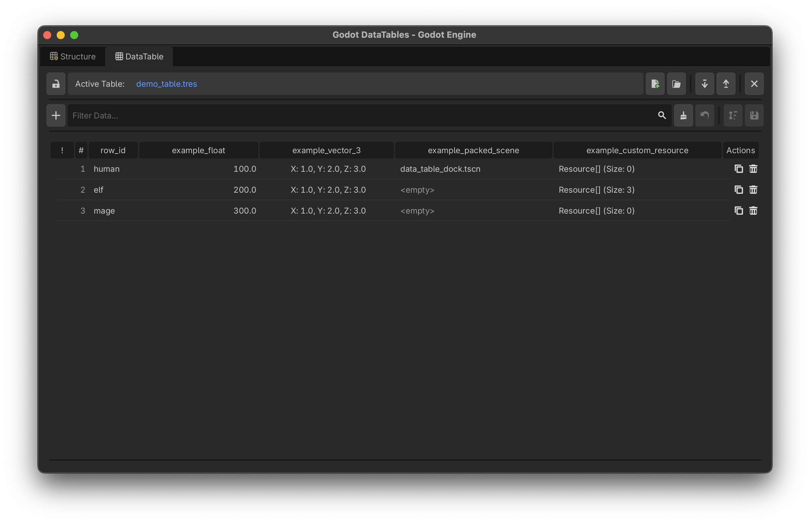

# DataTables
{: .no_toc }

Once you have compiled a **Data Structure**, you can use it as a blueprint to create a **DataTable**. 

A DataTable is the actual spreadsheet where you input your game's data. Under the hood, it is saved as a native Godot Resource (`.tres`), meaning it integrates flawlessly with the engine's Resource Loader and caches efficiently in memory.

  

    Table of contents
  

  {: .text-delta }
1. TOC
{:toc}

---

## The Spreadsheet Workspace

Switch to the **DataTable** tab in the bottom editor panel. When you create a new table, the addon will ask you where to save the `.tres` file, and then ask you to select the `.gd` Data Structure script you want to use as its template.

### Inline Editing
The grid is fully interactive. Depending on the data type you assigned in your schema, the cell will adapt:
* **Booleans** become clickable checkboxes.
* **Enums** become native drop-down lists.
* **Colors & Vectors** open specialized pop-up configurators when double-clicked.
* **Objects/Resources** open Godot's Quick Search menu when double-clicked, automatically filtered to only show valid resources (e.g., it will only let you pick a `Texture2D` if the column requires an image).

### Array Editor
If a column is an Array, double-clicking the cell will open the dedicated **Array Editor Popup**. This allows you to add, remove, edit, and drag-and-drop elements inside the array while maintaining strict type safety.

---

## Toolbar Breakdown

| Name | Function |
|:---|:---|
| **New Table** | Prompts for a save path and schema, then creates a blank `.tres` database. |
| **Load Table** | Opens the Quick Picker to load an existing `.tres` DataTable. |
| **Import** | Imports data from external CSV or JSON files. *(See Import/Export page).* |
| **Export** | Exports the current table to CSV or JSON. |
| **Add Row** | Injects a new, uniquely-named row into the table. |
| **Clear** | Wipes all rows from the active table. |
| **Close** | Closes the workspace. |
| **Revert** | Discards unsaved edits and reloads the table from disk. |
| **Lock/Unlock** | Toggles workspace protection to prevent accidental edits. |
| **Save** | Writes the current table data to the `.tres` file on disk. |
| **Save Sorting** | Permanently overwrites the internal array index order to match your current visual sorting. |

## Workflow Features
* **Unsaved Changes:** Modified rows glow with an orange warning indicator until you click **Save**.
* **Filtering & Sorting:** Use the search bar to instantly filter rows by ID or contents. Click any column header to sort A-Z or Z-A.
* **Drag and Drop:** You can drag rows by their `#` index to manually reorder them, or drag Resource files directly from your FileSystem dock into Object cells.
