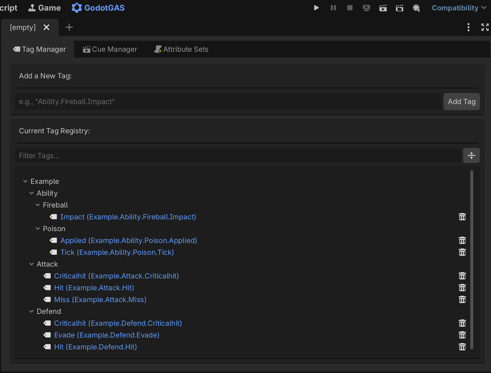
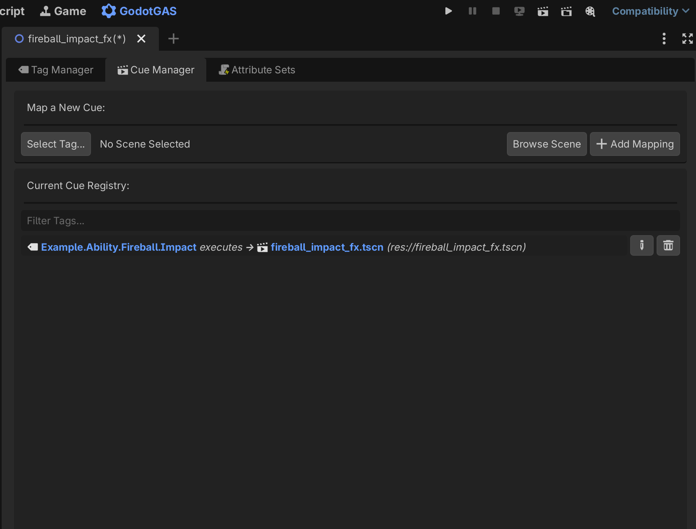
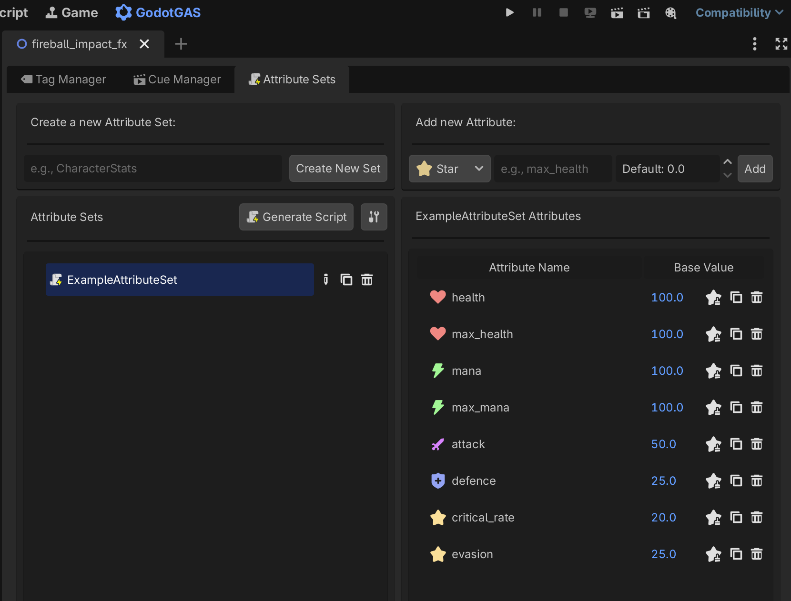

# 2. The Dashboard & Code Generation

GodotGAS includes a fully featured, custom editor dashboard integrated directly into your Godot Editor's main workspace (alongside the **2D**, **3D**, and **Script** tabs). This UI is the control center for your data-driven architecture, allowing you to manage Tags, Cues, and Attribute Sets without constantly digging through project files.

---

## The Tag Manager
<div align="center">
  
</div>

Gameplay Tags are the connective tissue of the GAS framework. They are hierarchical, optimized `StringName` values (e.g., `Status.Stunned`, `Event.Damage.Fire`) used to drive logic, cancel abilities, or trigger effects.

The Tag Manager tab provides a visual tree to manage your global `GameplayTagRegistry`:

* **Strict Validation:** To prevent typos and ensure clean architecture, the Tag Manager uses strict Regex validation. Tags must start with a capital letter, follow a hierarchical dot-notation, and contain no spaces (e.g., `Ability.Skill.Fireball`).
* **Global Access:** Once created in the Dashboard, these tags are automatically available to the runtime `GameplayTagManager` Autoload, allowing lightning-fast `StringName` comparisons anywhere in your code.

---

## The Cue Manager
<div align="center">
  
</div>

Gameplay Cues handle everything visual and auditory—particle effects, sound effects, camera shakes, or UI damage numbers. In GodotGAS, Cues are completely decoupled from game logic and managed via an optimized **Variant-based Object Pool**.

Using the Cue Manager tab:
1. **Map a Tag to a Scene:** You assign a specific Gameplay Tag (e.g., `Cue.Effect.Bleed`) to a `.tscn` file (e.g., `res://particles/bleed_fx.tscn`).
2. **Duplicate Checking & Filtering:** The UI prevents you from mapping the same tag twice and includes search filtering for large projects.
3. **Automatic Pooling:** At runtime, when an ability calls for `Cue.Effect.Bleed`, the global `GameplayCueManager` checks this registry, instantiates the scene (or pulls it from the Object Pool), and plays it instantly without instantiate lag.

---

## The Attribute Set Generator
<div align="center">
  
</div>

Writing stat definitions for every single RPG stat (Health, Mana, Strength, Armor) is tedious. GodotGAS solves this with a built-in Attribute Set Generator inspired by Unreal Engine's C++ macros.

### How to use the Generator:
1. Open the **Attribute Sets** tab in the Dashboard.
2. Define a new Set (e.g., `CombatAttributes`).
3. Add your raw stats using the UI (e.g., `min_health`, `max_health`, `health`, `attack_power`).
4. Click the **Settings (Gear Icon)** to pick the directory where you want the script saved (e.g., `res://gas_attributes/`).
5. Hit **Generate Script**.

### What it does behind the scenes:
The generator writes to a protected `_drafts.cfg` file while you work. When you hit Generate, it physically creates a completely standardized, `snake_case` GDScript file extending `AttributeSet` utilizing the `AttributeData` resource.

**Automatic Clamping via Prefixes:**
One of the most powerful features of the generator is how it handles value clamping. If you define attributes using the prefixes `min_` or `max_` alongside a base attribute, the generator automatically detects this relationship.

Instead of writing complex validation logic yourself, the generated script automatically overrides the `pre_attribute_change()` virtual function. This intercepts any mathematical modifications and clamps them natively before the value is ever applied:

```gdscript
@tool
class_name CombatAttributes extends AttributeSet

@export var min_health: AttributeData
@export var max_health: AttributeData
@export var health: AttributeData
@export var attack_power: AttributeData

func _init() -> void:
    if not min_health: min_health = AttributeData.new(0.0)
    if not max_health: max_health = AttributeData.new(100.0)
    if not health: health = AttributeData.new(100.0)
    if not attack_power: attack_power = AttributeData.new(50.0)

# The generator automatically detects the prefix relationship and writes this clamp!
func pre_attribute_change(attribute_name: StringName, new_value: float) -> float:
    if attribute_name == &"health":
        return clampf(new_value, min_health.get_current_value(), max_health.get_current_value())
    return new_value
```
