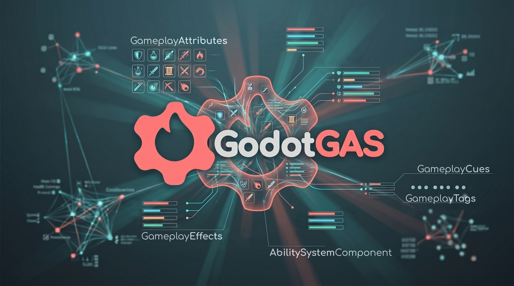

  

# GodotGAS Framework

[**Current Version: v1.0.0 Release Candidate**](https://github.com/yulrun/godot-gas)
[**☕ Buy me a Cofee**](https://ko-fi.com/yulrundev)

Welcome to the official documentation for GodotGAS. 

GodotGAS is a robust, data-driven framework written entirely in GDScript for Godot 4.6+. Heavily inspired by Unreal Engine's renowned Gameplay Ability System (GAS), it provides a highly scalable architecture for managing the complex interactions between abilities, attributes, tags, and status effects in your Godot projects.

## What is it for?

Whether you are building a sprawling RPG, a competitive MOBA, or a fast-paced action game, game logic can quickly devolve into a tangled web when handling status effects, damage calculations, and ability states. GodotGAS completely decouples these systems. 

It provides a standardized pipeline where abilities generate data, effects apply mathematical modifications, and an entity's central state manager (the Ability System Component) simply routes the information. This structure frees you up to focus on designing unique gameplay mechanics rather than untangling code dependencies.

## Roadmap & Advanced Networking

With the v1.0.0 release, the foundational architecture, Editor Dashboard, and core payload pipelines are locked, thoroughly verified, and production-ready. 

**Please Note:** Advanced Networking capabilities—specifically Server/Client Replication Sync and Client-side Prediction—are currently unavailable. Implementing a highly optimized, deterministic, and server-authoritative netcode model for the Ability System Component, attributes, and tags is a complex undertaking and is officially on the roadmap for our next major milestone.

---

*Use the navigation menu to explore the framework, learn how to install GodotGAS, set up your first Ability System Component, and master the data-driven architecture.*
